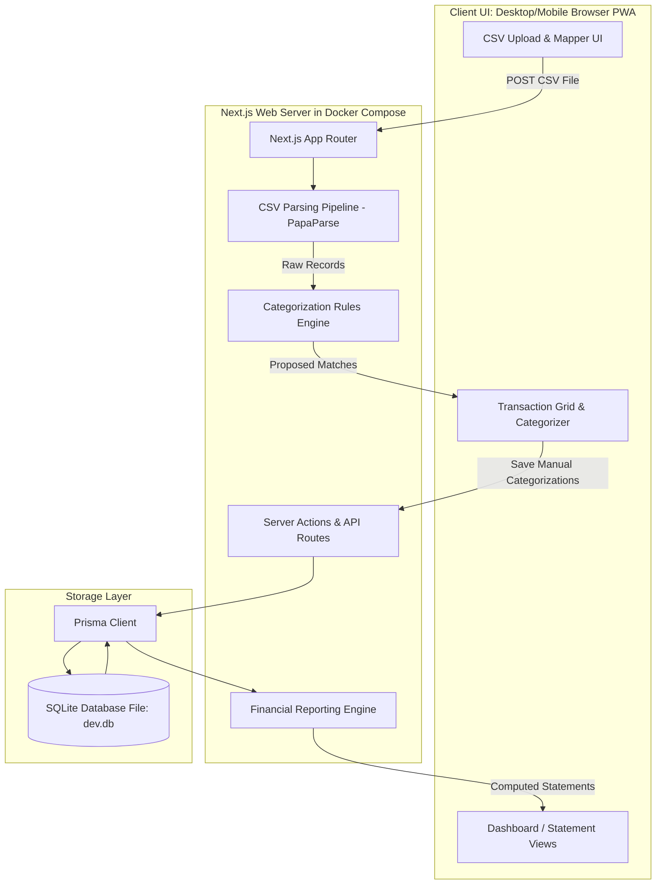

# System Architecture Review: Bank CSV Analyzer & Ledger

This document conducts a deep architectural review of the proposed application, evaluating the trade-offs, detailing the data flow, defining data models, and establishing architectural decisions (ADRs).

---

## 1. High-Level Architecture & Data Flow



### Component Responsibilities:
1. **Client (PWA)**: Desktop/mobile responsive dashboard utilizing Tailwind CSS v4 & DaisyUI v5. Communicates with server via Next.js Server Actions and JSON API routes. Caches static views and configuration details.
2. **Next.js Server**:
   - **CSV Pipeline**: Parses raw stream data and validates dates/amounts.
   - **Rules Engine**: Performs text pattern matching against merchant payees.
   - **Ledger Engine**: Computes Balance Sheet, Income & Expense, and Cash Flow views by executing indexed aggregate queries against SQLite.
3. **Database (Prisma + SQLite)**: Single-file relational storage mounted on the host machine.

---

## 2. Architecture Decision Records (ADRs)

### ADR-001: SQLite via Prisma vs Client-Side IndexedDB
* **Context**: The app is run locally, with data privacy as a top priority. We could run the entire application client-side in the browser using IndexedDB/WebAssembly, or run a local server-backed SQLite database.
* **Decision**: **Local Server-Backed SQLite with Prisma**.
* **Trade-Offs**:
  * **Pros**: 
    * Keeps data relationally structured; scales better with complex query grouping/aggregation.
    * Database is saved as a single file (`dev.db`) in the workspace, making it trivial for the user to back up, export, or check into Git.
    * Server-side CSV parsing handles larger files (>10MB) far better without blocking the main UI thread.
  * **Cons**: Requires a running local server (Docker) to function.
  * **Alternatives**: client-side-only WASM SQLite. This would allow serverless static hosting, but local Docker development is already a requested user constraint.

### ADR-002: Next.js App Router & Server Actions vs Dedicated Express/FastAPI API
* **Context**: We need to connect our SQLite database to the React UI. We can build a Next.js monorepo containing both API routes and React rendering, or separate the React frontend from a Python/FastAPI backend.
* **Decision**: **Next.js App Router (Mono-process)**.
* **Trade-Offs**:
  * **Pros**:
    * Simple deployment: runs under a single command inside one Docker container.
    * Server Actions eliminate boilerplate fetch calls and provide direct type safety from database queries to React component renders.
  * **Cons**: Next.js Docker images are slightly larger, and TypeScript compilation is bundled.
  * **Alternatives**: Vite + FastAPI. FastAPI is excellent for data/pandas processing, but splitting into two runtimes increases Docker orchestration overhead and manual API contract maintenance. Next.js handles TS files and database interactions cleanly out of the box.

### ADR-003: Double-Entry Ledger representation vs Simple Transaction Registry
* **Context**: To generate balance sheets and cash flow reports, standard financial systems use double-entry bookkeeping (debiting one account and crediting another). For an individual, managing a full double-entry ledger manually can be overly complex.
* **Decision**: **Modified Single-Entry Transaction Registry with Account Reference**.
* **Trade-Offs**:
  * **Pros**:
    * Matches the exact model of bank CSV outputs (which are simple lists of withdrawals/deposits on a single account).
    * Simpler CSV importing logic (each CSV line becomes exactly one Transaction).
    * Calculates Balance Sheet by mapping the Transaction to an `Account` (e.g. Bank Account or Credit Card) and running cumulative balances on top of a user-defined "Starting Balance".
  * **Cons**: Less native support for complex non-cash double-entry operations (like depreciation of physical assets or tracking accounts payable), which are typically unnecessary for individual personal finance.

---


## 3. Data Model Specification (Prisma Schema)

To support accurate financial statements, we structure the relational schema as follows:

```prisma
datasource db {
  provider = "sqlite"
  url      = env("DATABASE_URL") // e.g. "file:./dev.db"
}

generator client {
  provider      = "prisma-client-js"
  binaryTargets = ["native", "linux-musl-openssl-3.0.x"] // Ensures Docker compatibility
}

// Represents financial accounts (Assets & Liabilities)
model Account {
  id              String        @id @default(uuid())
  name            String        @unique
  type            String        // "ASSET" or "LIABILITY"
  startingBalance Float         @default(0)
  currency        String        @default("AUD")
  createdAt       DateTime      @default(now())
  updatedAt       DateTime      @updatedAt
  transactions    Transaction[]
}

// Represents financial categories (Income, Expense, Transfer)
model Category {
  id           String        @id @default(uuid())
  name         String        @unique
  type         String        // "INCOME", "EXPENSE", "TRANSFER"
  cashFlowType String        // "OPERATING", "INVESTING", "FINANCING"
  transactions Transaction[]
  rules        CategoryRule[]
}

// A ledger transaction record
model Transaction {
  id          String    @id @default(uuid())
  date        DateTime
  payee       String
  description String?
  amount      Float     // Positive for inflow, Negative for outflow
  accountId   String
  account     Account   @relation(fields: [accountId], references: [id], onDelete: Cascade)
  categoryId  String?
  category    Category? @relation(fields: [categoryId], references: [id], onDelete: SetNull)
  isReviewed  Boolean   @default(false)
  createdAt   DateTime  @default(now())
  updatedAt   DateTime  @updatedAt

  @@unique([date, payee, amount, description, accountId])
  @@index([accountId, date])
  @@index([categoryId, date])
}

// Simple rules for payee text matching auto-categorization
model CategoryRule {
  id         String   @id @default(uuid())
  pattern    String   // Regex or substring to match, e.g. "Uber", "Woolworths"
  categoryId String
  category   Category @relation(fields: [categoryId], references: [id], onDelete: Cascade)
  createdAt  DateTime @default(now())
  updatedAt  DateTime @updatedAt
}
```

---

## 4. Key Financial Calculators Architectural Logic

### Income & Expense (Net Income) Statement
Computed in a date range `[startDate, endDate]`:
1. Query `Transaction` where `date >= startDate AND date <= endDate`.
2. Group by `category.name` and sum `amount`.
3. Separate totals into `Income` categories (Type: INCOME) and `Expense` categories (Type: EXPENSE).
4. `Net Income = Sum(Income) - Sum(Expense)`.

### Balance Sheet
Computed up to a target `endDate`:
1. For each `Account`:
   - Calculate cumulative transaction change: `Sum(Transaction.amount) where date <= endDate`.
   - `CurrentBalance = StartingBalance + Sum(Transaction.amount)`.
2. Group accounts by `Account.type`:
   - **Total Assets** = Sum of checking, savings, investment accounts.
   - **Total Liabilities** = Sum of credit card, loan balances (as negative numbers representing debt).
3. **Net Worth (Equity)** = `Total Assets - Total Liabilities`.

### Cash Flow Statement
Computed in a date range `[startDate, endDate]` using the **Direct Method**:
1. Query `Transaction` where `date >= startDate AND date <= endDate`.
2. Filter out transactions where category type is `TRANSFER` (prevents self-transfer noise).
3. Sum transactions grouped by their category's `cashFlowType`:
   - **Operating Cash Flows**: Sum of standard income and expense transactions (salary, groceries, utilities).
   - **Investing Cash Flows**: Sum of transactions linked to investment asset buying/selling (stock buys, home purchases).
   - **Financing Cash Flows**: Sum of transactions related to debt repayments, loans, or equity injections.
4. Total Net Cash Flow = `Operating + Investing + Financing`.

---

## 5. Development Environment Isolation (Docker & Multi-Arch)

To prevent compile targets mismatch on native SQLite/Prisma bindings between a host developer machine (e.g. Apple Silicon macOS) and the Linux Alpine container, we execute the following steps:

1. **Prisma Engine Target Selection**:
   In the Prisma Schema `generator client`, we specify `binaryTargets = ["native", "linux-musl-openssl-3.0.x"]`. When running in Docker, it compiles client engines compatible with the container OS.
2. **Volume Layout**:
   We bind-mount `./` to `/app` inside the container but map an anonymous volume to `/app/node_modules`. This maps source code updates in real-time for hot-reloading, while letting the Docker build system install container-native node binaries.
3. **Prisma Generation hook**:
   When the container starts, it runs `npx prisma generate` followed by `npx prisma db push` inside the container before booting the dev server. This aligns schema alterations with the local SQLite database.
